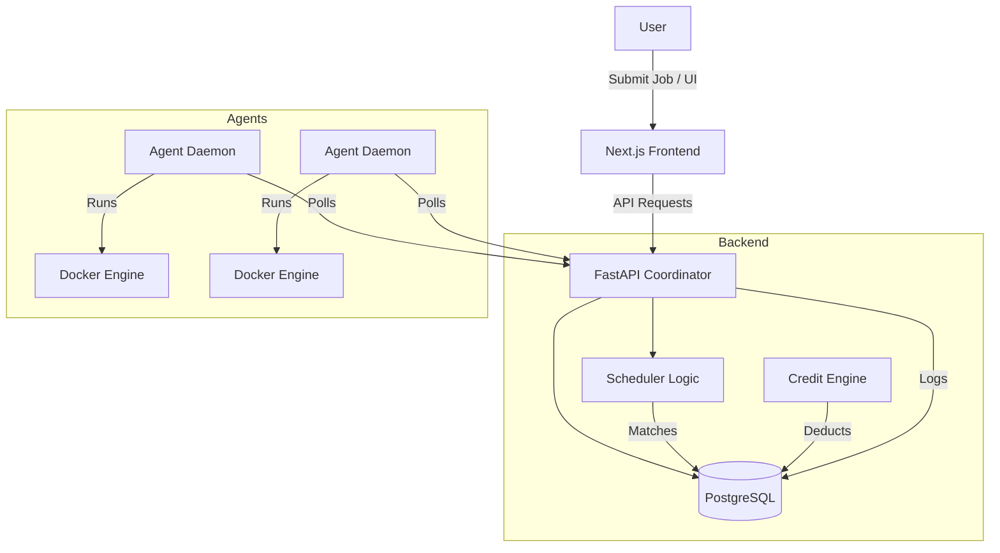

# Hive: Peer-Powered CI/CD

Hive is a decentralized compute-sharing platform where users submit jobs (as Zip files or Git repos) to be executed by a network of peer agents running Docker.

## Architecture



## Folder Structure

- `/backend` - FastAPI Coordinator
- `/frontend` - Next.js Dashboard
- `/agents` - Python Agent Daemon

## Setup & Run

### Prerequisites
- Docker & Docker Compose
- Python 3.9+
- Node.js 18+

### 1. Database
Start Postgres and Redis:
```bash
docker-compose up -d
```

### 2. Backend (Coordinator)
```bash
cd backend
python -m venv venv
# Windows: venv\Scripts\activate
# Linux: source venv/bin/activate
pip install -r requirements.txt

# Run Migrations (First time) - *Requires alembic configured*
# alembic upgrade head 
# For this demo, tables are created on startup if you add `Base.metadata.create_all(bind=engine)` in main.py or similar.

# Start Server
uvicorn app.main:app --reload
```

### 3. Frontend
```bash
cd frontend
npm install
npm run dev
```
Visit http://localhost:3000

### 4. Agent
Run an agent in a separate terminal:
```bash
cd agents
pip install -r requirements.txt
python main.py
```

## Features
- **Jobs**: Upload Zip, define build/run commands.
- **Economy**: Credits deducted per second of CPU/RAM usage.
- **Agents**: Auto-discovery via heartbeat.
- **Dashboard**: Real-time status and logs.
