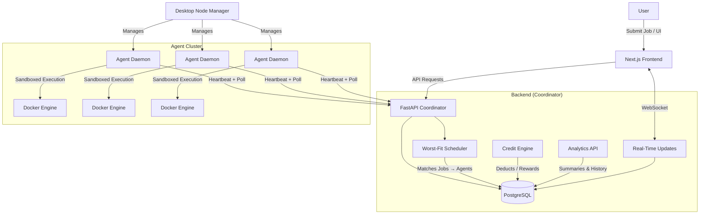

# 🐝 Hive — Peer-Powered Distributed CI/CD

Hive is a decentralized compute-sharing platform where users submit jobs (as Zip payloads or Git repos) to be executed by a network of peer agents running sandboxed Docker containers. It features a **credit-based economy**, **Slurm-style array job cloning**, **multi-step CI/CD pipelines**, **worst-fit load-balanced scheduling**, and **real-time WebSocket dashboards**.

<p align="center">
  
</p>

<p align="center">
  <a href="https://www.hives.codes/landing"><strong>🌐 Live Website</strong></a> &nbsp;·&nbsp;
  <a href="https://github.com/ewjinx/hive2/releases"><strong>⬇️ Download Agent</strong></a> &nbsp;·&nbsp;
  <a href="https://github.com/ewjinx/hive2"><strong>📦 GitHub</strong></a>
</p>

---

## Architecture


```mermaid
graph TD
    User[User] -->|Submit Job / UI| Frontend[Next.js Frontend]
    Frontend -->|API Requests| API[FastAPI Coordinator]
    Frontend <-->|WebSocket| WS[Real-Time Updates]

    subgraph Backend ["Backend (Coordinator)"]
        API --> DB[(PostgreSQL)]
        API --> Scheduler[Worst-Fit Scheduler]
        Scheduler -->|Matches Jobs → Agents| DB
        Credits[Credit Engine] -->|Deducts / Rewards| DB
        Analytics[Analytics API] -->|Summaries & History| DB
        WS --> DB
    end

    subgraph Agents ["Agent Cluster"]
        Agent1[Agent Daemon] -->|Heartbeat + Poll| API
        Agent2[Agent Daemon] -->|Heartbeat + Poll| API
        Agent3[Agent Daemon] -->|Heartbeat + Poll| API
        Agent1 -->|Sandboxed Execution| Docker1[Docker Engine]
        Agent2 -->|Sandboxed Execution| Docker2[Docker Engine]
        Agent3 -->|Sandboxed Execution| Docker3[Docker Engine]
    end

    DesktopApp[Desktop Node Manager] -->|Manages| Agent1
    DesktopApp -->|Manages| Agent2
    DesktopApp -->|Manages| Agent3
```

---

## Key Features

| Feature | Description |
|---|---|
| **Job Submission** | Upload Zip payloads with custom build/run commands via the web dashboard |
| **Array Jobs (Slurm-style)** | Clone a job across N nodes with `HIVE_ARRAY_INDEX` / `HIVE_ARRAY_SIZE` env vars automatically injected into each container |
| **Multi-Step Pipelines** | Define sequential CI/CD steps (e.g. Install → Test → Deploy); pipeline halts on first failure |
| **Test Case Distribution** | Automatic partitioning of `test_inputs.json` across array nodes for parallel test execution |
| **Worst-Fit Scheduling** | Jobs are assigned to the agent with the most available resources, maximizing utilization |
| **Weighted Fair Queuing** | Queue priority is determined by wait time × user credit balance |
| **Credit Economy** | Per-second billing for CPU/RAM; agents earn rewards; success bonuses and failure penalties |
| **Docker Sandboxing** | All jobs run in isolated containers with dropped capabilities, no-new-privileges, and network disabled |
| **Real-Time Logs** | WebSocket-powered live log streaming and dashboard updates |
| **Self-Healing Grid** | Stale agents auto-detected via heartbeat timeout; orphaned jobs re-queued to healthy nodes |
| **Desktop Node Manager** | Native tray-icon app with Flask + pywebview UI to manage agent nodes locally |
| **Analytics Dashboard** | Job distribution, resource usage, credit trends, per-user stats, and time-series charts |

---

## Project Structure

```
hive2/
├── backend/              # FastAPI Coordinator (Python)
│   ├── app/
│   │   ├── api/          # REST endpoints & WebSocket routes
│   │   │   └── endpoints/
│   │   │       ├── auth.py        # JWT authentication (OAuth2)
│   │   │       ├── users.py       # User CRUD & credit management
│   │   │       ├── agents.py      # Agent registration & heartbeats
│   │   │       ├── jobs.py        # Job submission, logs, pipelines
│   │   │       ├── analytics.py   # Dashboard analytics & per-user stats
│   │   │       └── ws.py          # WebSocket (dashboard + live logs)
│   │   ├── core/         # Config, auth utils, WebSocket manager
│   │   ├── credits/      # Credit engine (billing, bonuses, penalties)
│   │   ├── crud/         # Database CRUD operations
│   │   ├── db/           # SQLAlchemy session & base
│   │   ├── models/       # ORM models (User, Job, Agent, Transaction)
│   │   ├── schemas/      # Pydantic request/response schemas
│   │   └── scheduler/    # Worst-fit job scheduler with WFQ
│   ├── alembic/          # Database migrations
│   ├── requirements.txt
│   └── Dockerfile
│
├── frontend/             # Next.js Dashboard (TypeScript)
│   ├── app/
│   │   ├── (auth)/       # Login & Signup pages
│   │   ├── (hive)/       # Authenticated app shell
│   │   │   ├── dashboard/     # Real-time analytics dashboard
│   │   │   ├── jobs/          # Job list + detail (live logs)
│   │   │   ├── agents/        # Agent fleet management
│   │   │   ├── transactions/  # Credit transaction history
│   │   │   └── settings/      # User settings
│   │   └── landing/      # Public landing page
│   ├── components/       # Reusable UI components (shadcn/ui)
│   ├── hooks/            # Custom React hooks
│   ├── lib/              # API client utilities
│   └── package.json
│
├── agents/               # Python Agent Daemon
│   ├── main.py           # NodeManager — multi-threaded job executor
│   ├── docker_runner.py  # Docker container orchestration & log streaming
│   ├── desktop_app.py    # Desktop app (Flask + pystray + pywebview)
│   ├── config.py         # Agent configuration loader
│   ├── ui/               # Local web UI (HTML/CSS/JS)
│   └── requirements.txt
│
├── tests/                # Sample test jobs
├── payload_src/          # Sample payloads (e.g. calculate_pi.py)
├── docker-compose.yml    # PostgreSQL + Redis infrastructure
└── demo_guide.md         # Presentation walkthrough script
```

---

## Tech Stack

| Layer | Technology |
|---|---|
| **Backend** | Python 3.9+, FastAPI, SQLAlchemy, Alembic, Pydantic |
| **Frontend** | Next.js 15, React 19, TypeScript, Tailwind CSS, shadcn/ui, Recharts, SWR |
| **Agent** | Python, Docker SDK, psutil, Flask, pywebview, pystray |
| **Database** | PostgreSQL 15 |
| **Cache / Queue** | Redis 7 |
| **Containerization** | Docker & Docker Compose |
| **Auth** | JWT (OAuth2 password flow via `python-jose` + `passlib`) |
| **Real-Time** | WebSocket (FastAPI native) + Server-Sent Events (Agent UI) |

---

## Setup & Run

### Prerequisites

- **Docker & Docker Compose** — container runtime + infrastructure
- **Python 3.9+** — backend and agent
- **Node.js 18+** — frontend

### 1. Infrastructure (Database + Redis)

```bash
docker-compose up -d
```

This starts PostgreSQL (`localhost:5432`) and Redis (`localhost:6379`).

### 2. Backend (Coordinator)

```bash
cd backend
python -m venv venv
source venv/bin/activate      # macOS/Linux
# venv\Scripts\activate       # Windows

pip install -r requirements.txt

# Configure environment
cp .env.example .env          # macOS/Linux
# copy .env.example .env      # Windows

# Start server (tables are auto-created on startup)
uvicorn app.main:app --reload
```

The API will be available at **http://localhost:8000**. Interactive docs at `/docs`.

### 3. Frontend (Dashboard)

```bash
cd frontend
npm install
npm run dev
```

Visit **http://localhost:3000** — the landing page is the root, dashboard at `/dashboard`.

### 4. Agent (Node Manager)

#### Option A: Desktop App (recommended)

```bash
cd agents
pip install -r requirements.txt
python desktop_app.py
```

This launches a **system tray icon** and a local web UI at `http://localhost:5173`. Use it to:
- Log in with your Hive credentials
- Add / remove compute nodes
- Toggle nodes online/offline
- Monitor real-time job execution status

#### Option B: Headless Agent

```bash
cd agents
pip install -r requirements.txt
python main.py
```

Runs the agent daemon directly (requires pre-configured `agent_settings.json`).

---

## Credit Economy

Hive uses a credit-based billing system:

| Rate | Value |
|---|---|
| **Base fee** (per job) | 2.0 credits |
| **CPU cost** | 0.03 credits / core / second |
| **RAM cost** | 0.007 credits / GB / second |
| **Agent earns (CPU)** | 0.02 credits / core / second |
| **Agent earns (RAM)** | 0.005 credits / GB / second |
| **Success bonus** (agent) | +1.0 credit |
| **Failure penalty** (agent) | −0.5 credits |

Users with insufficient balance are skipped during scheduling. Low-balance alerts are sent when balance drops below 5.0 credits.

---

## Scheduling Algorithm

The scheduler runs every **5 seconds** and implements:

1. **Stale Agent Detection** — agents with no heartbeat for 15 seconds are marked offline
2. **Job Re-Queuing** — running jobs on stale agents are automatically re-queued
3. **Worst-Fit Allocation** — agents sorted by available resources (CPU + RAM) in descending order; jobs are assigned to the most available agent
4. **Weighted Fair Queuing (WFQ)** — queue priority = `wait_time × (1 + balance × 0.05)`, so longer-waiting and higher-balance users get priority

---

## Security

- **Zip Bomb Protection** — payloads capped at 500 MB uncompressed, path traversal checks
- **Docker Sandboxing** — `cap_drop=ALL`, `no-new-privileges`, `network_disabled=True`
- **Log Size Limits** — per-job log output capped at 10 MB
- **Agent Token Auth** — each agent authenticates with a unique token
- **JWT Auth** — all user-facing API endpoints secured with HS256 JWT tokens

---

## API Endpoints

| Method | Endpoint | Description |
|---|---|---|
| `POST` | `/api/v1/login/access-token` | OAuth2 password login |
| `POST` | `/api/v1/users` | Register new user |
| `GET` | `/api/v1/users/me` | Get current user profile |
| `POST` | `/api/v1/users/me/add-credits` | Add credits to account |
| `GET` | `/api/v1/agents` | List user's agents |
| `POST` | `/api/v1/agents` | Register new agent |
| `POST` | `/api/v1/agents/{id}/heartbeat` | Agent heartbeat |
| `GET` | `/api/v1/jobs` | List jobs (filterable) |
| `POST` | `/api/v1/jobs` | Submit new job |
| `GET` | `/api/v1/jobs/{id}` | Get job details |
| `GET` | `/api/v1/jobs/{id}/download` | Download job payload |
| `POST` | `/api/v1/jobs/{id}/logs` | Append job logs |
| `GET` | `/api/v1/analytics` | Dashboard analytics |
| `GET` | `/api/v1/analytics/summary` | Lightweight summary stats |
| `GET` | `/api/v1/analytics/history` | Time-series chart data |
| `GET` | `/api/v1/analytics/user/{id}` | Per-user analytics |
| `WS` | `/api/v1/ws/dashboard` | Live dashboard updates |
| `WS` | `/api/v1/ws/jobs/{id}/logs` | Live job log streaming |

---

## Sample Demo

A step-by-step demo script is available in [`demo_guide.md`](demo_guide.md). It walks through:

1. Starting the infrastructure (backend + frontend + desktop agent)
2. Configuring a 3-node compute grid
3. Submitting a 30-node Monte Carlo Pi estimation array job
4. Observing worst-fit load balancing across nodes
5. Live disaster recovery (killing a node mid-execution)
6. Multi-step pipeline submission (Install → Test → Deploy)

---

## Deployment

The Hive platform is **live-hosted** and publicly accessible:

| Component | URL |
|---|---|
| **Website (Dashboard & Landing)** | [hives.codes](https://www.hives.codes/landing) |
| **Agent Desktop App (Download)** | [GitHub Releases](https://github.com/ewjinx/hive2/releases) |
| **Source Code** | [github.com/ewjinx/hive2](https://github.com/ewjinx/hive2) |

### Downloading the Agent

1. Go to the [Releases page](https://github.com/ewjinx/hive2/releases)
2. Download the latest `HiveAgent.exe` (Windows) from the release assets
3. Run the executable — it launches a system tray icon and opens the Node Manager UI
4. Log in with your Hive account credentials to start contributing compute

> **Note:** The agent is built via PyInstaller (`agents/build_exe.bat`). To build from source, see the [Agent setup instructions](#4-agent-node-manager) above.

---

## License

This project is for academic / demonstration purposes.

